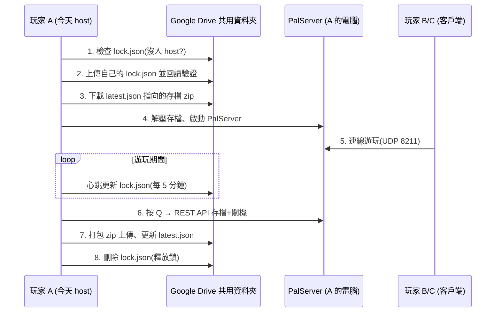
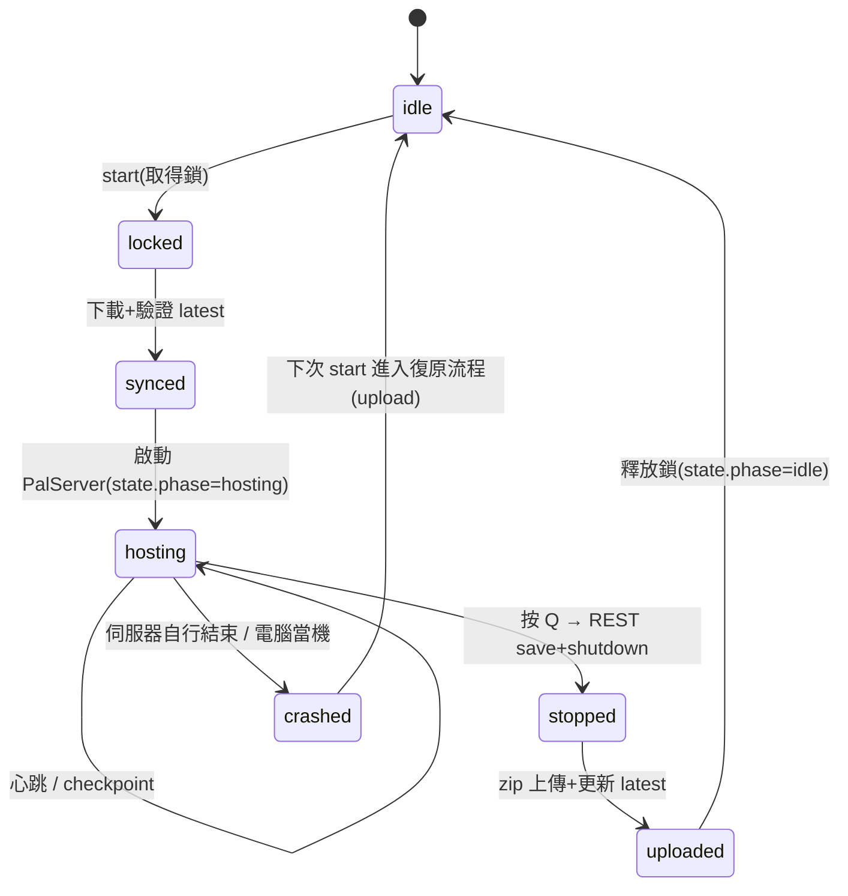

# PalRelay 設計文件與規格

> 讓一群朋友「誰有空誰開伺服器」地共玩同一個幻獸帕魯世界,
> 以 Google Drive 共用資料夾作為存檔的唯一真相來源(source of truth),
> 不需要 24 小時運作的雲端主機。

## 1. 背景與目標

### 問題

幻獸帕魯的合作模式(co-op)存檔綁在開世界的那個人身上:host 不在線,其他人就不能玩。
co-op 存檔還有「host 角色存在固定 GUID 槽位」的問題,直接把存檔搬給別人 host 會造成角色錯亂。

### 解法

改用官方 **Dedicated Server**(免費、可跑在任何人的電腦上)。在 dedicated server 上,
**所有玩家(包括開伺服器的人)都是用自己的固定 ID 連線的客戶端**,
所以伺服器存檔搬到任何一台電腦上執行,角色、公會、帕魯歸屬完全不受影響。

PalRelay 負責剩下的部分:

1. **鎖**:確保同一時間只有一個人開伺服器(避免存檔分岔)
2. **同步**:開服前自動下載最新存檔、關服後自動上傳
3. **版本與備份**:每次上傳保留歷史版本,存檔壞了可以回滾

### 非目標(明確不做)

- 不解決連線問題(建議全員裝 Tailscale,見 README)
- 不做存檔合併——兩份分岔的存檔**不可能**合併,這正是鎖存在的理由
- 不管理 co-op 存檔;既有 co-op 世界需先做一次性遷移(見第 13 節)
- 不自動安裝 PalServer / rclone(README 有安裝指引)

## 2. 系統總覽



### 核心決策

| 決策 | 選擇 | 理由 |
|---|---|---|
| 伺服器型態 | Dedicated Server 輪流開 | 徹底避開 co-op host GUID 問題 |
| 雲端儲存 | Google Drive(rclone 存取) | 免費 15GB、每個人都有帳號、rclone 處理認證 |
| 上傳單位 | 整包 zip + `latest.json` 指標 | 單檔上傳近似原子操作,不會拉到半新半舊的資料夾 |
| 鎖 | advisory lock 檔 + 心跳 + 回讀驗證 | Drive 沒有原子寫入,靠協議把競態窗口壓到秒級 |
| 實作語言 | PowerShell 5.1(單檔) | Windows 內建、朋友零安裝門檻(只需 rclone.exe) |
| 伺服器關機 | 官方 REST API(save + shutdown) | 優雅存檔關機,避免強殺造成壞檔 |

## 3. Google Drive 佈局

一個共用資料夾 = 一個群組,可容納任意多個世界(schema v2)。
由一人建立資料夾並分享給所有成員(編輯者權限),
每個成員的 rclone remote 以該資料夾為根(`root_folder_id`)。

```
(共用資料夾根目錄)
├── group.json               # 群組共用設定(adminPassword 等)
└── worlds/
    └── <世界名>/
        ├── lock.json        # 存在 = 有人正在 host;不存在 = 世界空閒
        ├── latest.json      # 指向最新存檔 zip 的指標(版本、檔名、sha256)
        └── saves/
            ├── world-v0007-20260720-133000-lother.zip
            └── ...          # 保留最近 keepVersions 份(預設 10)
```

v1(flat)佈局會在任一指令執行時自動遷移:`latest.json` 與 `saves/` 以
rclone `moveto`(伺服器端搬移)移入 `worlds/main/`;若偵測到未過期的
legacy 鎖則延後遷移。本機 `state.json` 亦同步升級為 per-world 結構。

## 4. 檔案格式規格

### 4.1 `lock.json`(雲端)

```json
{
  "holder": "lother",
  "machine": "DESKTOP-ABC123",
  "nonce": "8f14e45f-....",
  "startedUtc": "2026-07-20T12:00:00.0000000Z",
  "heartbeatUtc": "2026-07-20T12:35:00.0000000Z",
  "hostIp": "100.101.102.103",
  "serverPort": 8211,
  "toolVersion": "0.2.0"
}
```

`hostIp` 為 host 的 Tailscale IP(偵測不到則空字串),`serverPort` 為遊戲埠;
兩者一起構成公告給其他成員的連線位址,GUI 據此顯示「貼這個進遊戲」。

| 欄位 | 說明 |
|---|---|
| `holder` / `machine` | 誰、在哪台電腦 host,顯示給其他人看 |
| `nonce` | 每次取鎖隨機產生,用於「這把鎖是不是我上傳的那把」驗證 |
| `startedUtc` | 本次 session 開始時間(ISO 8601 UTC) |
| `heartbeatUtc` | 最後心跳時間;超過 `staleMinutes` 未更新即視為過期鎖 |

### 4.2 `latest.json`(雲端)

```json
{
  "version": 8,
  "zip": "world-v0008-20260720-153000-amy.zip",
  "sha256": "A94A8FE5...",
  "sizeBytes": 52428800,
  "worldGuid": "1A2B3C4D5E6F7A8B9C0D1E2F3A4B5C6D",
  "uploadedBy": "amy",
  "uploadedUtc": "2026-07-20T15:30:05.0000000Z",
  "toolVersion": "0.1.0"
}
```

- `version`:單調遞增整數,是全系統的版本序
- `sha256`:下載方必驗,防止傳輸不完整或 Drive 損毀
- `worldGuid`:`SaveGames/0/` 底下的世界資料夾名稱,下載方用它決定解壓目標與
  `GameUserSettings.ini` 的 `DedicatedServerName`

### 4.3 `state.json`(本機,工具目錄)

```json
{ "phase": "idle", "lastDownloadedVersion": 8, "hostingStartedUtc": "" }
```

- `phase`:`idle` 或 `hosting`。啟動時若為 `hosting` 代表上次沒有正常上傳(當機),進入復原流程
- `lastDownloadedVersion`:本機存檔對應的雲端版本;與 `latest.version` 相同且資料夾存在時跳過下載

### 4.4 `config.json`(本機,每人一份,不進版控)

| 欄位 | 必填 | 預設 | 說明 |
|---|---|---|---|
| `playerName` | ✔ | — | 顯示在鎖與上傳紀錄的名字(建議英數) |
| `remote` | ✔ | — | rclone remote,例如 `gdrive:`(root_folder_id 指向共用資料夾) |
| `serverDir` | ✔ | — | PalServer 安裝目錄,例如 `C:\PalServer` |
| `rclonePath` | | `rclone` | rclone 執行檔路徑(在 PATH 裡就不用改) |
| `rcloneConfig` | | `""` | rclone 設定檔路徑(`--config`);留空使用 rclone 預設位置 |
| `serverExe` | | `PalServer.exe` | 伺服器執行檔名 |
| `serverArgs` | | `[]` | 額外啟動參數(如 `-publiclobby`) |
| `adminPassword` | | `""` | 通常留空(自動改用雲端 `group.json` 的密碼);群組創始人首次執行時填這裡,工具會自動上傳成 group.json |
| `serverPort` | | `8211` | 遊戲連線埠(公告用) |
| `restPort` | | `8212` | REST API 埠 |
| `heartbeatMinutes` | | `5` | 心跳間隔 |
| `staleMinutes` | | `20` | 心跳超過此分鐘數視為過期鎖 |
| `checkpointMinutes` | | `0`(關閉) | >0 時每 N 分鐘自動上傳一次期中存檔 |
| `keepVersions` | | `10` | 雲端保留的 zip 份數 |
| `worldGuid` | | `""` | 通常自動偵測;`SaveGames/0` 下有多個資料夾時才需指定 |

### 4.5 `group.json`(雲端根目錄)

```json
{ "schemaVersion": 2, "adminPassword": "...", "createdBy": "lother", "createdUtc": "..." }
```

伺服器管理密碼的唯一真相來源:REST API 認證與 `PalWorldSettings.ini`
自動配置皆由此讀取,成員 config 免填、群主改密碼全群自動生效。
密碼解析順序:`group.json` → 本機 config(舊版相容/創始人引導)→ 空(警告)。

## 5. 鎖協議

### 取得鎖(`start` 時)

1. 讀取雲端 `lock.json`
   - 不存在 → 繼續
   - 存在且是自己的(holder+machine 相符)→ 繼續(重開視為續用)
   - 存在、別人的、**心跳新鮮** → 拒絕開服,顯示「XX 正在 host」,exit code 2
   - 存在、別人的、**心跳過期** → 警告「接管會遺失對方未上傳的進度」,需使用者確認(或 `-Force`)
2. 上傳含新 `nonce` 的 `lock.json`
3. **等待 3 秒後回讀**,`nonce` 不是自己的 → 判定搶鎖失敗,中止

### 心跳(遊玩期間,每 `heartbeatMinutes` 分鐘)

1. 回讀雲端鎖,`nonce` 非自己的 → 大聲警告(有人誤接管),**不覆寫**,提醒玩家群內協調
2. 是自己的 → 更新 `heartbeatUtc` 上傳

### 釋放鎖(上傳成功後)

回讀確認 `nonce` 是自己的才刪除;不是就留著不動(避免誤刪別人的鎖)。

### 競態分析(誠實面對)

Google Drive 沒有 compare-and-swap,兩人在**同一個 3 秒窗口內**同時上傳鎖,
理論上可能都通過回讀驗證(後寫者蓋掉先寫者,且先寫者在被蓋掉前完成回讀)。
緩解:(1) 回讀延遲 3 秒縮小窗口;(2) 心跳時二次驗證 nonce,誤入者會在 5 分鐘內收到警告;
(3) 實務上朋友群會先在群組喊「我要開了」。
若未來要根除,遷移到支援 conditional write 的 Cloudflare R2 即可(見第 14 節)。

## 6. Session 生命週期



關鍵不變量:**「釋放鎖」必定發生在「上傳成功」之後**。
上傳失敗時鎖會被刻意留著(其他人看到的是「還有人 host」),
避免別人從舊版本開服造成進度分岔;持鎖者用 `upload` 指令重試補上傳後才釋放。

### 復原流程

`start` 時發現 `state.phase == "hosting"`(上次當機):

1. 詢問「要先把本機存檔上傳嗎?」(預設是)→ 走 `upload` 流程
2. 使用者拒絕 → 警告本機進度可能被雲端覆蓋,重設為 idle 繼續

## 7. 上傳與版本管理

1. 對執行中伺服器先呼叫 REST `/save`(checkpoint 情境),或已關機(正常結束)
2. 將 `SaveGames/0/<worldGuid>/` 複製到暫存區(**排除伺服器自己的 `backup/`
   子資料夾**,避免 zip 無限膨脹),再 `Compress-Archive` 打包為
   `world-v{版本:4位}-{UTC時間戳}-{玩家}.zip`
3. 計算 SHA-256,`rclone copyto` 上傳至 `saves/`
4. `rclone lsjson` 回讀檔案大小驗證上傳完整
5. 上傳新 `latest.json`(此刻新版本才「生效」)
6. 修剪:保留版本號最大的 `keepVersions` 份,其餘刪除(`latest` 指向的 zip 永不刪)

下載方順序相反:讀 `latest.json` → 下載 zip → **驗 SHA-256** → 把本機現有存檔
搬到 `backups/`(保留 3 份)→ 解壓。

### Checkpoint(選配,`checkpointMinutes > 0`)

遊玩期間每 N 分鐘:REST `/save` → 複製存檔資料夾到暫存(避免壓到寫入中的檔案)→
照正常流程上傳為新版本。host 當機時全群最多損失 N 分鐘進度,代價是上傳流量。

## 8. 伺服器控制

- **啟動**:`Start-Process PalServer.exe`(工作目錄 = `serverDir`)
- **存活偵測**:偵測任何 `PalServer*` 名稱的行程(PalServer.exe 是包裝器,
  實際伺服器是 PalServer-Win64-Shipping-Cmd.exe 子行程)
- **關機**:REST API `POST /v1/api/save` → `POST /v1/api/shutdown`
  (Basic auth,帳號 `admin`,密碼 = `AdminPassword`)→ 等待行程結束(上限 90 秒)
  → 逾時才 `Stop-Process -Force` 並警告
- **世界指定**:每次開服前確保 `GameUserSettings.ini` 的
  `DedicatedServerName=<worldGuid>` 與要載入的世界一致

- **設定自動化**:`start` 前工具會自動生成/修補 `PalWorldSettings.ini`
  (以 `DefaultPalWorldSettings.ini` 為底,套用 config 的 `adminPassword`、
  `RESTAPIEnabled=True`、`RESTAPIPort`),使用者不需手動編輯 ini

## 9. 失敗模式與對策

| 情境 | 行為 |
|---|---|
| host 電腦當機 / 斷電 | 鎖心跳停止 → 20 分鐘後其他人可接管(損失該場未上傳進度);當機者重開機後 `start` 會提示先 `upload` |
| 關服後上傳失敗(網路斷) | 鎖保留、state 停在 hosting;修好網路後 `upload` 重試 |
| 下載的 zip 損毀 | SHA-256 驗證失敗即中止,本機存檔原封不動 |
| 兩人同秒搶鎖 | 3 秒回讀驗證擋掉絕大多數;殘餘窗口靠心跳二次驗證警告(見第 5 節) |
| 雲端存檔整份壞掉 | `saves/` 還有最近 10 版可手動回滾(改 `latest.json` 指標即可) |
| 誤接管非過期鎖 | `takeover` 對新鮮鎖一律拒絕,除非 `-Force`(要求先跟對方確認過) |

## 10. CLI 規格

```
palrelay.ps1 <command> [world] [-Force]
```

| 指令 | 功能 |
|---|---|
| `start [world]` | 完整 session:取鎖 → 下載 → 開服 → (按 Q)關服 → 上傳 → 釋放鎖;新名字即建立新世界 |
| `worlds` | 列出所有世界(鎖狀態、最新版本) |
| `status [world]` | 顯示誰在 host、最新版本、本機狀態 |
| `upload [world]` | 手動上傳本機存檔(當機復原、首次播種) |
| `takeover [world]` | 清除過期鎖(新鮮鎖需 `-Force`) |
| `init` | 從 `config.sample.json` 建立 `config.json` |
| `help` | 說明 |

省略 `[world]` 時依序採用:上次使用的世界 → 雲端唯一的世界 → `main`。
GUI(`palrelay-gui.ps1`)以 dot-source 重用本體並覆寫 console I/O 函式,
協議行為與 CLI 完全一致。

Exit codes:`0` 成功 / `1` 一般錯誤 / `2` 鎖被他人持有 / `3` 設定錯誤 / `5` 伺服器異常結束且未上傳。

## 11. 安全性考量

- Drive 共用資料夾僅分享給成員;rclone token 存在各自本機
- `config.json` 含 `adminPassword`,加入 `.gitignore`,不放進共用資料夾
- REST API 埠(8212)只在本機使用,**不要**對外開放防火牆;對外只開 UDP 8211
- 存檔 zip 內含所有玩家角色資料,視同群組私有資料

## 12. 一次性遷移(既有 co-op 世界)

既有 co-op 世界需做一次 host 角色 GUID 修復 + 搬移到 dedicated server 存檔位置,
用社群工具(PalworldSaveTools 或 Physgun 網頁版轉換器)完成,之後由該成員執行
`palrelay.ps1 upload` 播種為 v1。此後永遠不再需要動存檔內部。

## 12.5 既有 co-op 世界匯入(v0.3)

2026 夏季更新後存檔為 PlM(Oodle)格式,由 `tools/palfix.py`(CI 以 PyInstaller
打包為 `palfix.exe`)處理:

- **解析**:palworld-save-tools 0.24.0 + quadrantbs/palworld-hostfix-toolkit
  的 patch(pin commit `306dd72`,MIT);PlM 解壓靠 libooz.dll(zao/ooz,
  上游無授權條款,故**不隨包散佈**,使用時經同意後下載並驗 SHA-256)
- **寫回**:一律 zlib(PlZ)——遊戲仍接受舊壓縮格式,免實作 Oodle 壓縮
- **`import` 指令**:掃描 `%LOCALAPPDATA%\Pal` 的 co-op 世界(以 LevelMeta
  解出世界名)→ 複製進伺服器(原檔不動)→ 刪 WorldOption.sav(讓 ini 生效)
  → 播種為雲端新世界 v1,並記錄既有玩家檔清單(state 的 `importPlayers`)
- **`fixhost` 指令**:原主機第一次加入伺服器建立新角色後執行。策略為
  **params swap**:把舊角色的 SaveParameter 灌進「伺服器親手建立並接受」的
  新角色條目(其檔案/條目/公會接線全部保留原樣),另做帕魯 key 歸零、
  Owner 修正、容器欄位修正與容器 re-key;依 `importPlayers` 自動辨識新角色檔
- **保守模式(關鍵)**:所有寫入 Level.sav 的操作只解碼
  CharacterSaveParameterMap 與 CharacterContainerSaveData(經驗證可正確
  re-serialize);公會、物品容器 slots、地圖物件等半解碼結構一律原始位元組
  直通。實戰教訓:全量解碼重寫會損壞新格式公會 blob,導致伺服器拒認玩家並
  無限重生新角色
- **自動驗證與回滾**:`fix` 寫入後立即執行身分鏈驗證(玩家檔 uid/instance ↔
  唯一角色條目 ↔ group_id 指向存在的公會 ↔ 玩家檔引用的容器全數存在、
  無殘留 legacy 條目);任一環失敗即自動還原 Level.sav 與玩家檔備份並以
  非零碼結束。`palfix verify --dir <world> --uid <hex32>` 可隨時獨立診斷
- 明確不做:改寫 Players/*.sav(伺服器會拒收)、手改公會成員名單
  (新格式為 ASCII hex 字串 + 未知結構;公會異動交給遊戲內操作)
- 一次性代價:外觀維持新角色(遊戲內鏡子可改)、公會需遊戲內重邀
- 訪客玩家的角色 GUID 在 co-op 與 dedicated 相同,毋須處理

## 13. 測試策略

- `test/fake-rclone.ps1`:模擬 rclone 的 `cat` / `copyto` / `deletefile` / `lsjson`
  子指令,以本機資料夾模擬 Drive,讓鎖協議與上傳/下載/修剪邏輯可離線自動化測試
- `test/run-tests.ps1`:以 dot-source 載入主腳本(`PALRELAY_TEST=1` 跳過主流程),
  對各函式做整合測試(取鎖、搶鎖拒絕、過期接管、上傳、下載驗證、修剪、壞檔偵測)
- 真實 PalServer 與真實 Drive 的端到端測試需手動進行(見 README 驗收清單)

## 14. 未來工作

- **根除鎖競態**:後端抽換為 Cloudflare R2(S3 conditional write,原子取鎖)
- **連線資訊自動公告**:lock.json 加入 host 的 Tailscale IP,做個 `join` 指令直接顯示
- **Discord webhook**:開服/關服/接管自動通知群組
- **GUI**:系統匣小程式,「開始 host」「收工」兩顆按鈕
- **SteamCMD 整合**:開服前自動更新伺服器版本(全員版本一致才能連線)
